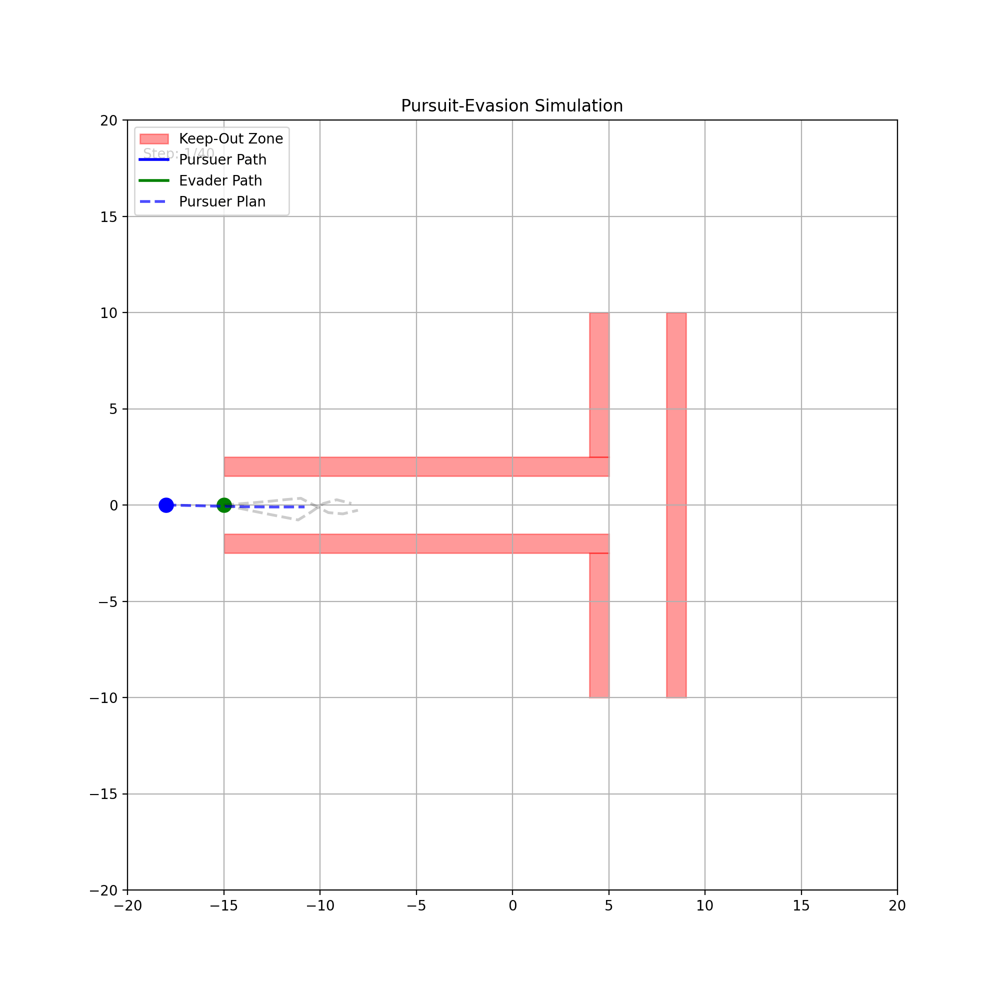

# Simple Tracker

This is a simple receeding horizon controller for tracking a **non-evasive** target. We assume that when the evader in view we are recieving rollout trajectories from the PWM. 


MacOS set up with `Homebrew`.
```bash
brew info pkg-config        
brew install ipopt
python3.11 -m venv env
source env/bin/activate
brew install ipopt, py
```

You can also use conda: See cyipopt docs: https://cyipopt.readthedocs.io/en/stable/install.html
```bash
conda install -c conda-forge cyipopt
```

To run solver

```bash
python SimpleTracker/ipopt_sim.py
```

## Problem Formulation

- We want to minimize the distance between the expected pursuer trajectory and pursuer trajectories over a look ahead horizon of  time steps.
- When the target is in the field of view we will use PWM provided trajectories to do planning with receding horizon control with out of the box solvers. 
- We will formulate the problem as a non-linear program. 
- We assume discrete time trajectories but continuous state space. 
- We can solve this online with an IPOPT solver or something similar i.e Gurobi. 

## Objective Function

$$
J(x) = \sum_{j=1}^M p_j(\sum_{k=1}^{T}w^k||x_k-y_k^{(j)}||^2) + \lambda_{penalty} \sum_{k=1}^{T}(\max0,d_{min}^2- ||x_k - \bar y_k ||^2)
$$


We will minimize expected squared distance between pursuer and evader over a horizon of $T$ time steps. I've added a penatly term to discourage getting too close the the evader but it is not a hard constraint.


- $p_j$ Prob of jth evader trajectory. We can let $p_j=1$  if we assume all paths are equally likely. 
- $w_k$ This weighs the trajaectory at different time steps. We can either prioritize near or shortterm interception depending on how reliable we believe rollouts are.
- $x_k$ : Puruser position at timestep $k$
- $y_k$ : Evader position at timestep $k$
- $M$ : Total pursuer trajectories
- $T$ : Look ahead horizon where each timespte is of size $\Delta t$
- $d$ : Min allowable distance between evader and pursuer. 

## Constraints

For each timestep $k \in [1,T]$ we impose the following constaints on the pursuer;

### Fixed starting location (linear)

$x_1$ is the current pursuer location

$$
x_1 = x_{current}
$$

### Boundary constraints (linear) : $x_k$ has to stay within stay within zone and out of KOZ

The pursuer is forbidden from entering specified convex polygonal regions (Keep-Out Zones). A convex polygon can be represented by a set of linear inequalities, known as half-planes. For a point $\mathbf{z}$ to be inside the polygon, it must satisfy all half-plane inequalities simultaneously:

$$ A\mathbf{z} \le \mathbf{b} $$

This is equivalent to satisfying $a_i^T \mathbf{z} - b_i \le 0$ for all faces $i$ of the polygon, where $a_i^T$ is the $i$-th row of matrix $A$.

To remain outside the polygon, a point $\mathbf{x}_k$ in the pursuer's trajectory must violate at least one of these conditions. This can be expressed with the `max` function:

$$ \max_{i} (a_i^T \mathbf{x}_k - b_i) \ge 0 $$

Because the `max` function is not smoothly differentiable, which is required by gradient-based optimizers like IPOPT, we use the `LogSumExp` function as a smooth approximation. This yields a single, non-linear inequality constraint for each point $\mathbf{x}_k$ in the trajectory and for each KOZ. The constraint is formulated as:

$$
\alpha \log \left( \sum_{i=1}^{N_{\text{faces}}} \exp\left(\frac{\mathbf{a}_i^T \mathbf{x}_k - b_i}{\alpha}\right) \right) \ge 0
$$


### Motion constraints (quadratic) 

Distance covered in one time step is bounded by max velocity, i.e 

$$||x_{k+1} - x_k||^2 \le (v_{max}\Delta t)^2$$ 

for 

$$k = 1 ,..., N-1$$


## File Structure

```
SimpleTracker/
│
├── README.md        Project explanation, setup, and usage instructions
│
├── simulate.py    # Main script to run the pursuit-evasion simulation and save the results
├── animator.py    # Creates a GIF animation from the simulation history data
│
├── track.py     # Trajectory optimization solver using SLSQP from SciPy
│
├─- dummy_pwm.py    # Contains PWM code: Evader kinematic model and functions to generate predicted trajectories
|-- ipopt_sim.py # Simulation script for ipopt solver
|-- track_ipopt.py # Trajectory optimizatio sovler using IPOPT solver. 
```

## Demo



## Demo 


